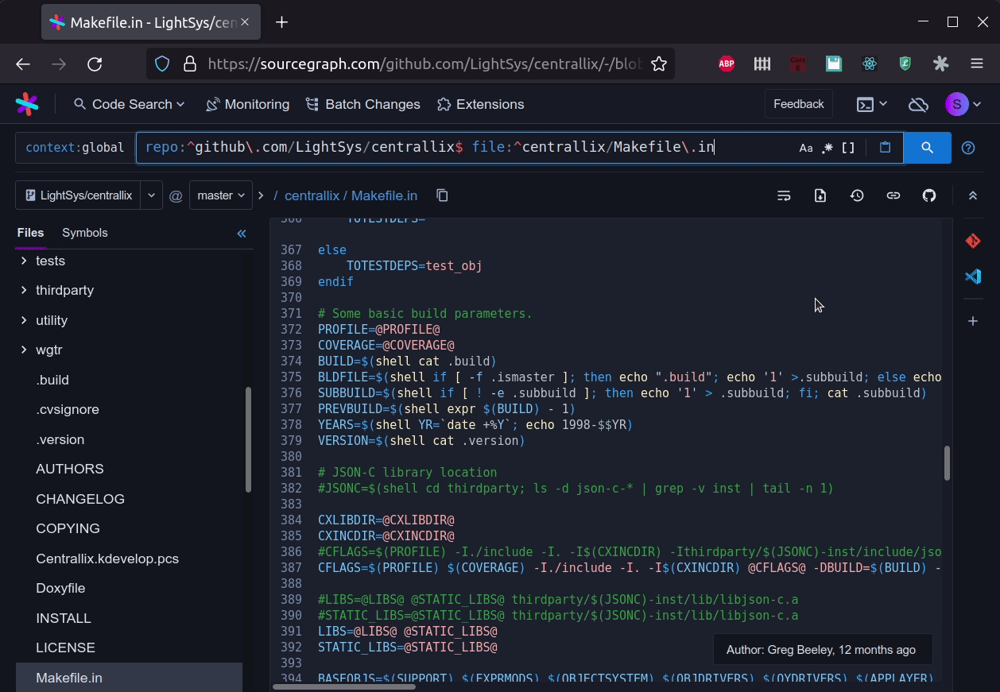
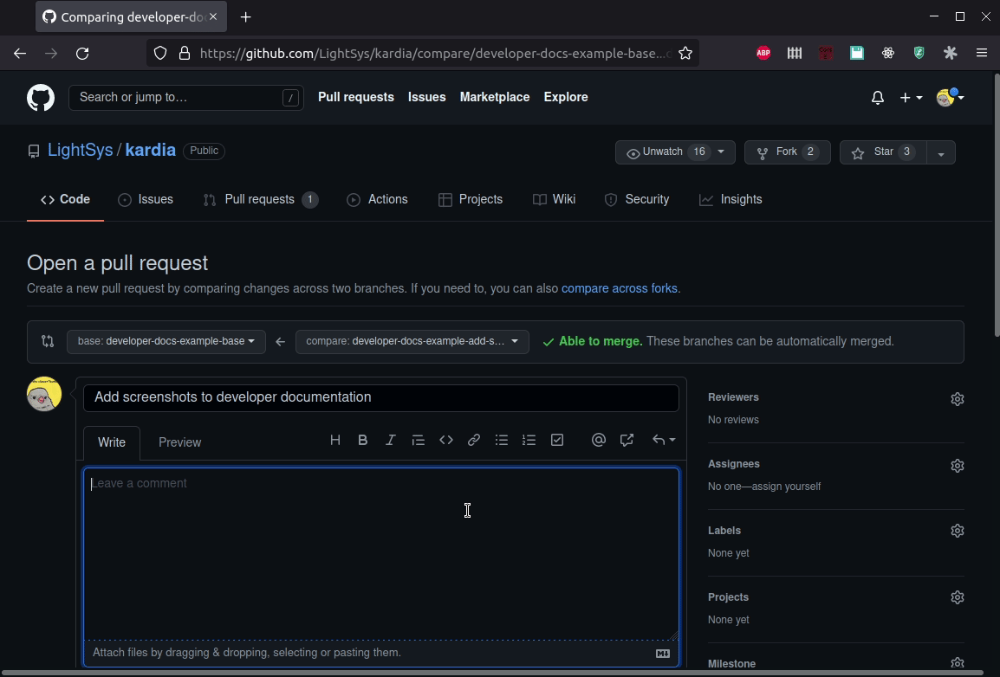

# Suggestions for Centrallix + Kardia developer tools
Here are my (Alison's) suggestions for how to set yourself up to work on Centrallix or Kardia. These are all tools that I've personally found very helpful as I've gotten to know and started contributing to Centrallix and Kardia. If you are a new Centrallix or Kardia developer, I encourage you to consider using them!

An overview of the toolchain:
- Centrallix + Kardia hosted on a [virtual machine](#using-a-kardia-vm) available on the network
- [VSCode](#developing-with-vscode) for connecting to the VM, editing code, and using the command line to interact with it
- [Sourcegraph](#sourcegraph-code-search) for searching and browsing code
- [GitHub](#working-with-git-and-github) for keeping track of changes in pull requests where you can collaborate and get code review

## Quickstart
This document includes some orientation and tips for people who may be new to tools like Git, VSCode, and code search. If you are a more experienced developer and want to get going quickly, here's a summary of how to get set up.

1. Get a [Centrallix/Kardia VM](#why-a-virtual-machine) from Greg and SSH into it.
2. Familiarize yourself with [where to find your Kardia instance and build it](#working-on-the-source-code).
3. [Install VSCode](#install-vscode), [set up remote access to your VM](#connect-to-a-remote-vm), and [install helpful language extensions](#language-specific-extensions).
4. Familiarize yourself with [Sourcegraph code search](#so-how-do-i-use-sourcegraph).
5. Make sure you're [set up to push your Centrallix/Kardia changes to GitHub](#getting-set-up-to-push-to-github) and [take a look at how we use pull requests to review and organize changes](#using-github-pull-requests).

## Table of Contents
- [Suggestions for Centrallix + Kardia developer tools](#suggestions-for-centrallix--kardia-developer-tools)
  - [Quickstart](#quickstart)
  - [Table of Contents](#table-of-contents)
  - [Using a Kardia VM](#using-a-kardia-vm)
    - [Why a virtual machine?](#why-a-virtual-machine)
    - [Intro to SSH](#intro-to-ssh)
    - [Using SSH with your Kardia VM](#using-ssh-with-your-kardia-vm)
    - [Working on the source code](#working-on-the-source-code)
    - [Command line tips](#command-line-tips)
  - [Developing with VSCode](#developing-with-vscode)
    - [Why VSCode?](#why-vscode)
    - [Install VSCode](#install-vscode)
    - [Connect to a remote VM](#connect-to-a-remote-vm)
    - [Language-specific extensions](#language-specific-extensions)
    - [Other VSCode tips](#other-vscode-tips)
  - [Sourcegraph code search](#sourcegraph-code-search)
    - [Why use code search?](#why-use-code-search)
    - [So how do I use Sourcegraph?](#so-how-do-i-use-sourcegraph)
    - [Example: where do I need to update usage of this type?](#example-where-do-i-need-to-update-usage-of-this-type)
    - [Example: how should I use this function?](#example-how-should-i-use-this-function)
    - [Example: how was someone previously able to implement this feature?](#example-how-was-someone-previously-able-to-implement-this-feature)
  - [Working with Git and GitHub](#working-with-git-and-github)
    - [Intro to Git](#intro-to-git)
    - [Getting set up to push to GitHub](#getting-set-up-to-push-to-github)
    - [Using GitHub pull requests](#using-github-pull-requests)
    - [Tips for organizing your work into commits + pull requests](#tips-for-organizing-your-work-into-commits--pull-requests)
    - [Basic Git cheatsheet](#basic-git-cheatsheet)
  - [TODO: Working with gdb](#todo-working-with-gdb)

*This table of contents was automatically generated using [this VSCode extension](https://marketplace.visualstudio.com/items?itemName=yzhang.markdown-all-in-one). If you modify this file, you may want to install it to help you update the TOC.*

## Using a Kardia VM

### Why a virtual machine?
Centrallix's structure is tightly integrated with the Linux operating system (for example, Kardia users are also just regular Linux user accounts). For this reason among others, it's usually easiest to have your Centrallix/Kardia environment for development on a [virtual machine](https://www.redhat.com/en/topics/virtualization/what-is-a-virtual-machine).

It's theoretically possible to [set up your own Kardia VM](https://github.com/LightSys/kardia/tree/master/kardia-vm), but usually Greg will just provide you with a virtual machine running on a LightSys server. Then you can just use your local machine to remotely access your Kardia installation and code.

### Intro to SSH
[SSH](https://www.ssh.com/academy/ssh) is a classic Linux tool for securely connecting to another computer over a network. Typically, you use SSH from the command line to connect to a remote system and bring up a command line for it.


If you're completely new to SSH, [here's a basic guide for how to use SSH on Windows, Mac, or Linux](https://www.howtogeek.com/311287/how-to-connect-to-an-ssh-server-from-windows-macos-or-linux/).

I also like to set up passwordless authentication for places I SSH into often. This basically involves generating a pair of public + private cryptographic keys on your local machine, giving the remote your public key, and then telling SSH to use your private key when logging into the remote. [Here's a basic tutorial for how to set up SSH public key authentication on Windows, Mac, or Linux.](https://kb.iu.edu/d/aews)

### Using SSH with your Kardia VM
For my Kardia VMs, I like to use a configuration something like this (this goes in my SSH configuration file, which on Linux is at `~/.ssh/config`) after setting up public key authentication:
```
Host kardia-vm
  HostName 10.5.16.16
  User alison
  IdentityFile ~/.ssh/kardia-key
  Port 16
```

Also note that if you're using a LightSys-hosted Kardia VM, there may be some extra steps to using it when you're not connected to the LightSys network. Check with Greg before you plan to do this.

### Working on the source code
Once you're in your VM...
- You can find Centrallix source code at `/usr/local/src/cx-git` and Kardia source code at `/usr/local/src/kardia-git`
- Run the command `kardia.sh` and go into `Developer Tools` if you...
  - modified Centrallix code and need to recompile it
  - changed the structure of the Kardia database and need to rebuild it
  - need to start/stop/restart Centrallix
  - You can do various other things from `kardia.sh`, but you can also mess a lot of things up. I recommend being cautious and not experimenting too much.
- To run Centrallix tests, go into the `centrallix` folder under `cx-git` and run the command `make test`. You can do the same for Centrallix-Lib tests in `centrallix-lib`. There's more information about writing and running tests in the READMEs in `centrallix/tests` and `centrallix-lib/tests`.
  - There are currently no automated tests for Kardia.
- To actually view your Kardia install in a browser, navigate to `http://[IP address]:800/apps/kardia` (for example, `http://10.5.16.16:800/apps/kardia`). You can log in with the same username and password you use to get into your VM.

### Command line tips
[Here's a basic cheat sheet for Linux shell commands you can use while SSHed into your VM.](https://oit.ua.edu/wp-content/uploads/2020/12/Linux_bash_cheat_sheet-1.pdf)

My favorite Linux command line tip is to hit Ctrl+R to start typing in a search for a command you've previously run. Press Enter to run the currently suggested command, Ctrl+R again to "scroll" through matches for your search, or Esc to get out of your search. This is handy if you occasionally need to type in long commands and don't want to remember the whole thing.

## Developing with VSCode

### Why VSCode?
You're welcome to work on Centrallix and Kardia just using a text editor in a terminal like vim or emacs, or with some other development environment entirely. However, I suggest using VSCode because:

- it's highly flexible and configurable
- it's cross-platform and popular with lots of help and extensions available
- it's free
- it offers several convenient tools for working on Kardia, all in one centralized place

Here are some instructions for how I've set up VSCode for my Kardia development.


In this screenshot, I'm on my laptop connected to a LightSys VM entirely through VSCode.

### Install VSCode
https://code.visualstudio.com/docs/setup/setup-overview

### Connect to a remote VM
The [Remote SSH VSCode extension](https://marketplace.visualstudio.com/items?itemName=ms-vscode-remote.remote-ssh) basically lets you work on code on an SSH remote as if it were on your local machine. Once VSCode is connected to the SSH server, you can browse and edit code on it, open an integrated terminal, and do various other fancy things without needing to pull up a separate normal SSH terminal session.

[Here's an overview of how to set up VSCode remote development over SSH.](https://code.visualstudio.com/docs/remote/ssh) If you haven't already set up key-based passwordless authentication to log into your VM, I highly recommend that you do so since it makes VSCode's interfacing with SSH much smoother.

If you start up VSCode one day and it has issues connecting to your VM, try SSHing into the VM normally and deleting the `.vscodeserver` folder in your home directory (`rm -r ~/.vscodeserver`). LightSys-hosted VMs are usually small, and VSCode can take up a lot of space copying files over to the VM as part of its remote functionality.

If you don't want to use this VSCode extension for some reason, another option for interacting with files on the VM locally is sshfs.

### Language-specific extensions
- Install this [Kardia language extension](https://marketplace.visualstudio.com/items?itemName=lightsys.centrallix-syntax-highlighting) for VSCode to do basic syntax highlighting of Kardia structure files. This is an in-house LightSys project, so if you have issues with it, you can always [contribute yourself](https://github.com/sheesania/centrallix-syntax-highlighting) :)
- If you're working on Centrallix, consider installing this [C language extension](https://marketplace.visualstudio.com/items?itemName=ms-vscode.cpptools). Centrallix does not currently integrate very well with this extension (it doesn't know how to offer code hints/IntelliSense, for example), but it at least adds syntax highlighting.
- TODO: style settings (insert final newline, ...)

### Other VSCode tips
- VSCode has an integrated terminal that's handy for running tests, kardia.sh, etc as you develop. Use Ctrl+` to open or close it. If you are connected to a remote with the Remote SSH extension, the opened terminal will be for the remote.
- Both the Centrallix and Kardia repositories are quite large. If you have a repo open in VSCode and want to jump quickly to a particular file, hit Ctrl+P and start typing the name of the file.
- VSCode has a nice interface for working with Git - browsing through changes you've made, staging and committing them, resolving merge conflicts, etc. Click the "Source Control" button in the sidebar to take a look.
  - However, I highly recommend that you learn how to use the Git command line first before relying on a graphical tool like this. It's easy to get yourself into some nasty, gnarly situations with Git if you don't understand how it works under the hood, no matter how friendly the interface you're using.
- Centrallix and Kardia code currently doesn't follow a standard for tabs and spaces, and so many files have a mixture. If the code you're viewing is strangely indented or if you're having other problems with this, it may help to:
  - Show indicators in the editor for different kinds of whitespace by selecting View > Render Whitespace
  - Adjust how you want to input tabs, and how you'd like to display tabs, with the "Adjust Indentation" button in the bottom right bar. For example, if I select "Spaces: 4", when I press Tab 4 spaces will be inserted, and the editor will display tab characters as 4 characters long.


VSCode also has an extension for Sourcegraph code search, which I'm about to tell you about...

## Sourcegraph code search

### Why use code search?
[Sourcegraph](https://sourcegraph.com/search) is a powerful web-based tool for searching and browsing code. It offers two main features: advanced search with regexes and lots of specific filters, and insights into code like where a symbol is referenced elsewhere.

Here are a few things you can use Sourcegraph to do:
- Find where a function is defined so you can figure out what it really does under the hood.
- Find everywhere a function or a type is used.
- Find an existing example of how to do something so you don't have to figure it out from scratch - how you can invoke a particular function, how to use a piece of the Centrallix API, ...
- Use git blame to figure out how old a piece of code is or why it was added or changed in the first place.
- Since Sourcegraph is web-based, you can easily send links to specific files or even lines of code to a teammate.

Sourcegraph is your best friend for figuring out how Centrallix and Kardia work and how to develop in them yourself. When you find yourself wanting to ask a question about how something works, you can also consider if there's some way you can hunt it down yourself with a few search queries.

### So how do I use Sourcegraph?
- In a browser, you can start searching the Centrallix repo from https://sourcegraph.com/github.com/LightSys/centrallix@master or the Kardia repo from https://sourcegraph.com/github.com/LightSys/kardia@master
- You can also install the [Sourcegraph VSCode extension](https://marketplace.visualstudio.com/items?itemName=sourcegraph.sourcegraph), which lets you search from within VSCode and open VSCode files in regular web-based Sourcegraph.
  - Try typing "repo:centrallix" or "repo:kardia" in the search bar to get a suggestion for the official LightSys repositories on GitHub.

Here's a [cheatsheet for keywords you can use in Sourcegraph search queries](https://docs.sourcegraph.com/code_search/reference/queries). Or mouse over any element in a search query you've typed to see an explanation of how Sourcegraph will interpret it.

### Example: where do I need to update usage of this type?
I once worked on a project to change the fundamental design of a very basic Centrallix struct. I needed to find all the places that struct was used so I could make them work with the new struct design. Here's how I did it with Sourcegraph using search + find references.


### Example: how should I use this function?
As part of this project, I had to write some logic that needed to log an error under particular conditions. But how should I use the error handling function I found in code nearby for my particular case? Here's how I used Sourcegraph's go to definition + find references to get an idea of how the error handling function works.


### Example: how was someone previously able to implement this feature?
"Test coverage" is a way to see what code actually got run (and thus what logic paths were actually tested) after you run automated tests. At one point, Centrallix was able to track coverage, but Centrallix-Lib was not and a few interns were adding some gnarly logic to it. So I needed to figure out how test coverage had been implemented in Centrallix so I could build it for the part that now also needed it. Here's how I used git blame in Sourcegraph to track that down.



## Working with Git and GitHub

### Intro to Git
If you're not already familiar with Git, I encourage you to take the time to understand it! At a basic level, Git simply tracks changes to code. But if you use it well, it can help you break down problems, organize your process for writing code, and work together with other people without getting in each other's way. It also leaves easily accessible records of this process so you can go back and understand how a baffling, buggy, or otherwise important piece of code got built in the first place.

So while Git can be pretty confusing at first, I think it's worth your while to try to understand how it works and not just memorize a few magic commands. Here's a [friendly basic introduction](https://hackernoon.com/understanding-git-fcffd87c15a3). For more about Git than you'll probably ever want to know, there's the [official Git book](https://git-scm.com/book/en/v2).

### Getting set up to push to GitHub
The Centrallix and Kardia repositories on your Kardia VM should already be hooked up to GitHub so they know how to pull from and push to GitHub. However, you'll still need to tell GitHub who you are and set up authentication.

GitHub currently does not allow you to just use a standard username and password to authenticate when you push, pull, etc (whether from the command line or a tool like VSCode). I recommend that you [set up SSH key-based authentication](https://docs.github.com/en/authentication/connecting-to-github-with-ssh) to authenticate yourself.

In addition, you should create a `.gitconfig` file in your home directory (`~/.gitconfig`), or, if it already exists, open it. You can use VSCode with a remote as described above, or just SSH into your VM and [use vim](https://github.com/yuanqing/vim-basics/blob/main/README.md).

Your `.gitconfig` should have a block like this:
```
[user]
  email = [your GitHub username]@users.noreply.github.com
  name = [name you want associated with your commits]
```
For example, here's what mine looks like:
```
[user]
  email = sheesania@users.noreply.github.com
  name = Alison Blomenberg
```
Once you've saved your `.gitconfig`, GitHub should connect any commits you push to your GitHub account 1) without revealing your email 2) associating the name in the `.gitconfig` with them.

### Using GitHub pull requests
In GitHub parlance, a "pull request" is a request to merge one branch into another. It's typically used to keep track of changes you're making as part of a feature/bugfix/etc, and once the project is done, request that they be incorporated into the main branch of the codebase.

Here's how to create a basic pull request in GitHub. (If GitHub shows you the "X branch had recent pushes" banner, that's a nice shortcut; otherwise you can go to the regular "branches" page.)


Once you've created a pull request, you can also leave comments on the changes or request review from someone else. This offers a centralized place to work through how to implement something that you can then look back at later.


You may also run into situations where you create a pull request that depends on another pull request. For example, I had a pull request for a barebones working version of the report emailing tool, then a pull request based on that one for adding filtering. In this case, you should:

- Set the base branch of the child pull request to its parent pull request


- In the description of the child pull request, add "Depends on #[ID of parent pull request]"



- A friendly GitHub bot will tell you not to merge the child before the parent is merged.


### Tips for organizing your work into commits + pull requests
With Git and GitHub, you have two main "buckets" to organize your changes with: commits and pull requests.

Each commit should ideally be a small set of logically related changes. For example, when I added an automated report emailing tool to Kardia, I committed when I set up the general project structure, when I added one function to an API for getting report information, when I wrote the basic structure for talking to that API, when I added error handling to that structure, etc. Each commit should have a descriptive commit message. Better for the message to be too long than for it to be confusing!

Once you've made a bunch of commits to a branch, you can create a "pull request" in GitHub for that branch. This is a request to merge the commits in the branch into another branch (usually master). So a pull request is essentially a bucket of commits. Again, ideally a pull request should be a small set of logically related commits that come together to produce one small, individually working feature, bug fix, or step of a larger project. For example, with the report emailing tool, I had pull requests for a very basic but working version, for adding filtering, for fleshing out the README, for a dry run option, etc.

Small, logically organized, well-described commits and pull requests make it much easier in the future to see why and how changes were made when you're trying to debug a problem, add a similar feature, or just understand what on earth is going on in some old code. This is especially important for Kardia and Centrallix, which have many short-term contributors who don't have time to do a lot of digging through code. Any work you put into organizing and describing your changes will probably make another developer's life much easier in the future.

### Basic Git cheatsheet
To give you a head start if you're new to Git, here are the Git commands I typically use day to day as I begin and work on a new project.

Make sure I'm on the master branch:
```
git checkout master
```
Make sure I have the latest version of the master branch from GitHub:
```
git pull
```
Create a new branch based on master:
```
git checkout -b [branch name]
```
Now I'll start working. Occasionally I might come and check what files I've edited (this will also tell me what branch I'm currently on):
```
git status
```
To see what specific changes I've made:
```
git diff
```
Once I'm done with some changes, I'll "stage" them:
```
git add [file name I've changed]
```
I can also just stage all files I've updated:
```
git add -u
```
Or stage all updated AND new files:
```
git add -A
```
At any point, I can use `git status` again to see what I've staged or not (and `git status` will also tell you how to un-stage if you want to). To see what exact edits I've staged:
```
git diff --staged
```
When I'm ready to commit that batch of staged changes:
```
git commit -m "description of changes"
```
Once I've made a commit, I'll push it to GitHub so the changes are present in GitHub's copy of the branch:
```
git push
```
Once I'm finished with the feature/bug fix/whatever's in the branch and I'm getting ready to merge it into the master branch, I'll also make sure that I've incorporated the latest version of master into my branch:
```
git checkout master
git pull
git checkout [my branch name]
git merge master
```

## TODO: Working with gdb
- gdb cheatsheet https://darkdust.net/files/GDB%20Cheat%20Sheet.pdf
- to debug a test: gdb [local executable test file]
- gdb with kardia.sh??
- simple example of setting a breakpoint in a file and then inspecting a variable value
- some way to attach VSCode debugging GUI to gdb?
